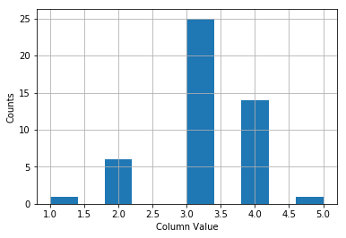
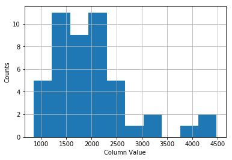
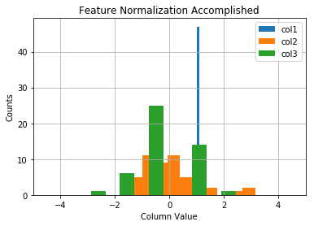
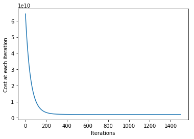

Machine Learning Online Class - Exercise 1: Linear Regression

Instructions
------------

This file contains code that helps you get started on the
linear exercise. You will need to complete the following functions
in this exericse:

     warmUpExercise
     plotData
     gradientDescent
     computeCost
     gradientDescentMulti
     computeCostMulti
     featureNormalize
     normalEqn

For this exercise, you will not need to change any code in this file,
or any other files other than those mentioned above.


## warmUpExercise


```python
import numpy as np
```

```python
def warmUpExercise():
    return(np.identity(5))
```

```python
warmUpExercise()
```


    array([[1., 0., 0., 0., 0.],
           [0., 1., 0., 0., 0.],
           [0., 0., 1., 0., 0.],
           [0., 0., 0., 1., 0.],
           [0., 0., 0., 0., 1.]])


## Plotting the data


```python
## Loading the data 

data_ext1 = np.loadtxt("../ex1/ex1data1.txt", delimiter= ",")
```

```python
data_ext1[0:4]
```


    array([[ 6.1101, 17.592 ],
           [ 5.5277,  9.1302],
           [ 8.5186, 13.662 ],
           [ 7.0032, 11.854 ]])


```python
X = np.c_[np.ones(data_ext1.shape[0]),data_ext1[:,0]]
X[0:4]

# A column of ones has been added to accomodate the theta0 term (intercept term)
```


    array([[1.    , 6.1101],
           [1.    , 5.5277],
           [1.    , 8.5186],
           [1.    , 7.0032]])


```python
y = np.c_[data_ext1[:,1]]
y[0:4]
```


    array([[17.592 ],
           [ 9.1302],
           [13.662 ],
           [11.854 ]])


```python
import matplotlib.pyplot as plt
```

```python
plt.scatter(X[:,1], y, s=30, c='r', marker='x', linewidths=1)
plt.xlim(4,24)
plt.xlabel('Population of City in 10,000s')
plt.ylabel('Profit in $10,000s');
```


```python
import dill
filename = 'ProgrammingExercise1.pkl'
dill.dump_session(filename)
```
## Gradient Descent

### Compute Cost


```python
def computeCost(X, y, theta):
    """
    COMPUTECOST Compute cost for linear regression
    J = COMPUTECOST(X, y, theta) computes the cost of using theta as the
    parameter for linear regression to fit the data points in X and y
    """
    # Initialize some useful values
    m = y.shape[0] # number of training examples
    
    
    # We need to return the following variables correctly 
    
    J=0
    
    """
    ====================== OUR CODE HERE ======================
    Instructions: Compute the cost of a particular choice of theta
    We should set J to the cost.
    """
    
    J = np.sum(np.square(np.matmul(X,theta)-y))/(2*m)
    
    
    return(J)
    
```

```python
computeCost(X,y,theta=[[0],[0]])

## Expected cost value (approx) 32.07
```


    32.072733877455676


```python
# Checking compute cost for one more value

computeCost(X,y,theta=[[-1],[2]])

## Expected cost value (approx) 54.24, pretty close huh !!
```


    54.24245508201238


### Gradient Descent Code


```python
def gradientDescent(X, y, theta, alpha, num_iters):
    """
    GRADIENTDESCENT Performs gradient descent to learn theta
    theta = GRADIENTDESCENT(X, y, theta, alpha, num_iters) updates theta by
    taking num_iters gradient steps with learning rate alpha
    """
    
    m = y.shape[0]  ## Number of training examples
    J_history = np.zeros(num_iters)  ## Initializing J to 0
    
    ## Starting the iterations
    
    for iteration in np.arange(num_iters):
        """
        ====================== OUR CODE HERE ======================
        Instructions: Perform a single gradient step on the parameter vector theta
        """
        
        theta = theta - (alpha/m)*np.transpose(np.matmul(np.transpose(np.matmul(X,theta)-y), X))
        
        ## Please note the importance of adding intercept term to X in the beginning
        
        J_history[iteration] = computeCost(X, y, theta)
        
    return(theta, J_history)
    
```

```python
## Check theta values as in the assignment

theta , Cost_Iterations = gradientDescent(X, y, theta=[[0],[0]], alpha=0.01, num_iters=1500)

print theta

## Expected theta values (approx): -3.6303  1.1664
```
    [[-3.63029144]
     [ 1.16636235]]


```python
plt.plot(Cost_Iterations)
plt.ylabel('Cost at each iteration')
plt.xlabel('Iterations');
```


```python
# Predict values for population sizes of 35,000 and 70,000

predict1 = np.matmul([1, 3.5] ,theta)

predict1
```


    array([0.45197679])


```python
predict2 = np.matmul([1, 7] ,theta)

predict2
```


    array([4.53424501])


## Visualizing the results


```python
## Plotting the fitted line
# Getting the relevant x and y coordinates

xcoord = np.linspace(5,23)
ycoord = theta[0] + theta[1]*xcoord # this is simply y = mx + c

# Plot gradient descent
plt.scatter(X[:,1], y, s=30, c='r', linewidths=1)
plt.plot(xcoord,ycoord, label='Linear regression Gradient descent')
```


    [<matplotlib.lines.Line2D at 0x10da00f90>]


### Visualizing J(theta_0, theta_1)


```python
from mpl_toolkits.mplot3d import axes3d
```

```python
# Grid over which we will calculate J

theta0_vals = np.linspace(-10, 10, 100)
theta1_vals = np.linspace(-1, 4, 100)

Zvalues_J = np.zeros((theta0_vals.shape[0],theta1_vals.shape[0]))
xxcoord, yycoord = np.meshgrid(theta0_vals, theta1_vals, indexing='xy') # my favourite function which has no such counterpart in R or maybe

# Calculate Z-values (Cost) based on grid of coefficients
for (i,j),v in np.ndenumerate(Zvalues_J):
    Zvalues_J[i,j] = computeCost(X,y, theta=[[xxcoord[i,j]], [yycoord[i,j]]])
    
fig = plt.figure(figsize=(15,6))
ax1 = fig.add_subplot(121)
ax2 = fig.add_subplot(122, projection='3d')

# Left plot
CS = ax1.contour(xxcoord, yycoord, Zvalues_J, np.logspace(-2, 3, 20), cmap=plt.cm.jet)
ax1.scatter(theta[0],theta[1], c='r')

# Right plot
ax2.plot_surface(xxcoord, yycoord, Zvalues_J, rstride=1, cstride=1, alpha=0.6, cmap=plt.cm.jet)
ax2.set_zlabel('Cost')
ax2.set_zlim(Zvalues_J.min(),Zvalues_J.max())
ax2.view_init(elev=15, azim=230)

# settings common to both plots
for ax in fig.axes:
    ax.set_xlabel(r'$\theta_0$', fontsize=17)
    ax.set_ylabel(r'$\theta_1$', fontsize=17)
```


```python
# Saving checkpoint
import dill
filename = 'ProgrammingExercise1.pkl'
dill.dump_session(filename)
```
## Linear Regression with multiple variables


```python
## Reading the data

data_ext2 = np.loadtxt("../ex1/ex1data2.txt", delimiter= ",")
data_ext2[0:4]
```


    array([[2.104e+03, 3.000e+00, 3.999e+05],
           [1.600e+03, 3.000e+00, 3.299e+05],
           [2.400e+03, 3.000e+00, 3.690e+05],
           [1.416e+03, 2.000e+00, 2.320e+05]])


```python
## Getting the X and y vector

X_multi = np.c_[np.ones(data_ext2.shape[0]),data_ext2[:,[0,1]]]
X_multi[0:4]
```


    array([[1.000e+00, 2.104e+03, 3.000e+00],
           [1.000e+00, 1.600e+03, 3.000e+00],
           [1.000e+00, 2.400e+03, 3.000e+00],
           [1.000e+00, 1.416e+03, 2.000e+00]])


```python
y_multi = np.c_[data_ext2[:,2]]
y_multi[0:4]
```


    array([[399900.],
           [329900.],
           [369000.],
           [232000.]])


```python
#Plot feature one to find out its scales
plt.grid(True)
plt.hist(X_multi[:,2],label = 'col2')
plt.xlabel('Column Value')
plt.ylabel('Counts');
```





```python
plt.grid(True)
plt.hist(X_multi[:,1],label = 'col2')
plt.xlabel('Column Value')
plt.ylabel('Counts');
```





Clearly the data needs feature scaling and normalization


```python
from sklearn.preprocessing import scale
```

```python
"""
FEATURENORMALIZE Normalizes the features in X
FEATURENORMALIZE(X) returns a normalized version of X where
the mean value of each feature is 0 and the standard deviation
is 1. This is often a good preprocessing step to do when
working with learning algorithms.
"""
X_multi_Norm = scale( X_multi, axis=0, with_mean=True, with_std=True, copy=True )
X_multi_Norm[:,0] = np.ones(data_ext2.shape[0])
X_multi_Norm
```


    array([[ 1.00000000e+00,  1.31415422e-01, -2.26093368e-01],
           [ 1.00000000e+00, -5.09640698e-01, -2.26093368e-01],
           [ 1.00000000e+00,  5.07908699e-01, -2.26093368e-01],
           [ 1.00000000e+00, -7.43677059e-01, -1.55439190e+00],
           [ 1.00000000e+00,  1.27107075e+00,  1.10220517e+00],
           [ 1.00000000e+00, -1.99450507e-02,  1.10220517e+00],
           [ 1.00000000e+00, -5.93588523e-01, -2.26093368e-01],
           [ 1.00000000e+00, -7.29685755e-01, -2.26093368e-01],
           [ 1.00000000e+00, -7.89466782e-01, -2.26093368e-01],
           [ 1.00000000e+00, -6.44465993e-01, -2.26093368e-01],
           [ 1.00000000e+00, -7.71822042e-02,  1.10220517e+00],
           [ 1.00000000e+00, -8.65999486e-04, -2.26093368e-01],
           [ 1.00000000e+00, -1.40779041e-01, -2.26093368e-01],
           [ 1.00000000e+00,  3.15099326e+00,  2.43050370e+00],
           [ 1.00000000e+00, -9.31923697e-01, -2.26093368e-01],
           [ 1.00000000e+00,  3.80715024e-01,  1.10220517e+00],
           [ 1.00000000e+00, -8.65782986e-01, -1.55439190e+00],
           [ 1.00000000e+00, -9.72625673e-01, -2.26093368e-01],
           [ 1.00000000e+00,  7.73743478e-01,  1.10220517e+00],
           [ 1.00000000e+00,  1.31050078e+00,  1.10220517e+00],
           [ 1.00000000e+00, -2.97227261e-01, -2.26093368e-01],
           [ 1.00000000e+00, -1.43322915e-01, -1.55439190e+00],
           [ 1.00000000e+00, -5.04552951e-01, -2.26093368e-01],
           [ 1.00000000e+00, -4.91995958e-02,  1.10220517e+00],
           [ 1.00000000e+00,  2.40309445e+00, -2.26093368e-01],
           [ 1.00000000e+00, -1.14560907e+00, -2.26093368e-01],
           [ 1.00000000e+00, -6.90255715e-01, -2.26093368e-01],
           [ 1.00000000e+00,  6.68172729e-01, -2.26093368e-01],
           [ 1.00000000e+00,  2.53521350e-01, -2.26093368e-01],
           [ 1.00000000e+00,  8.09357707e-01, -2.26093368e-01],
           [ 1.00000000e+00, -2.05647815e-01, -1.55439190e+00],
           [ 1.00000000e+00, -1.27280274e+00, -2.88269044e+00],
           [ 1.00000000e+00,  5.00114703e-02,  1.10220517e+00],
           [ 1.00000000e+00,  1.44532608e+00, -2.26093368e-01],
           [ 1.00000000e+00, -2.41262044e-01,  1.10220517e+00],
           [ 1.00000000e+00, -7.16966387e-01, -2.26093368e-01],
           [ 1.00000000e+00, -9.68809863e-01, -2.26093368e-01],
           [ 1.00000000e+00,  1.67029651e-01,  1.10220517e+00],
           [ 1.00000000e+00,  2.81647389e+00,  1.10220517e+00],
           [ 1.00000000e+00,  2.05187753e-01,  1.10220517e+00],
           [ 1.00000000e+00, -4.28236746e-01, -1.55439190e+00],
           [ 1.00000000e+00,  3.01854946e-01, -2.26093368e-01],
           [ 1.00000000e+00,  7.20322135e-01,  1.10220517e+00],
           [ 1.00000000e+00, -1.01841540e+00, -2.26093368e-01],
           [ 1.00000000e+00, -1.46104938e+00, -1.55439190e+00],
           [ 1.00000000e+00, -1.89112638e-01,  1.10220517e+00],
           [ 1.00000000e+00, -1.01459959e+00, -2.26093368e-01]])


```python
#Quick visualize the feature-normalized data
plt.grid(True)
plt.xlim([-5,5])
dummy = plt.hist(X_multi_Norm[:,0],label = 'col1')
dummy = plt.hist(X_multi_Norm[:,1],label = 'col2')
dummy = plt.hist(X_multi_Norm[:,2],label = 'col3')
plt.title('Feature Normalization Accomplished')
plt.xlabel('Column Value')
plt.ylabel('Counts')
dummy = plt.legend()
```





```python
## Check theta values as in the assignment

initial_theta = np.zeros((X_multi_Norm.shape[1],1))

theta_multi , Cost_Iterations_multi = gradientDescent(X_multi_Norm, y_multi, theta=initial_theta, alpha=0.01, num_iters=1500)

print theta_multi
```
    [[340412.56301439]
     [109370.05670466]
     [ -6500.61509507]]


```python
plt.plot(Cost_Iterations_multi)
plt.ylabel('Cost at each iteration')
plt.xlabel('Iterations');
```





```python
# Computing cost at 1650 sq ft and 3 bedrooms
X_multi_mean = np.mean(X_multi, axis=0)
X_multi_std = np.std(X_multi, axis=0)
ytest = np.array([1650.,3.])
ytestscaled = [(ytest[x]-X_multi_mean[x+1])/X_multi_std[x+1] for x in xrange(len(ytest))]
ytestscaled.insert(0,1)
predict1_multi = np.matmul(ytestscaled ,theta_multi)
predict1_multi
```


    array([293098.46667577])


```python
from numpy.linalg import inv
#Implementation of normal equation to find analytic solution to linear regression
def normEqtn(X,y):
    #restheta = np.zeros((X.shape[1],1))
    return np.dot(np.dot(inv(np.dot(X.T,X)),X.T),y)
```

```python
print "Normal equation prediction for price of house with 1650 square feet and 3 bedrooms"
print "$%0.2f" % float(np.matmul([1,1650.,3], normEqtn(X_multi,y_multi)))
```
    Normal equation prediction for price of house with 1650 square feet and 3 bedrooms
    $293081.46


```python
# Saving checkpoint
import dill
filename = 'ProgrammingExercise1.pkl'
dill.dump_session(filename)
```
